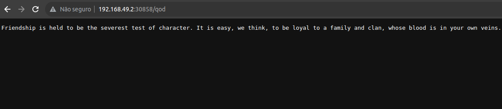

<h2> Servidor Redis </h2>

- Deployment;
- Service (ClusterIP);
- Secret;

<h2> Aplicação </h2>

- Deployment;
- Service (NodePort);
- ConfigMap;
- Secret;

 

    
     
    Recursos do Cluster

 

    
     
    Acesso ao grk-app pelo nó/vm do minikube

    
     
    Em produção o Ingress Controller é o recurso mais indicado para expor rotas HTTP e HTTPS para serviços dentro do Cluster, porém, para fins de estudo foi utilizado o NodePort. 

